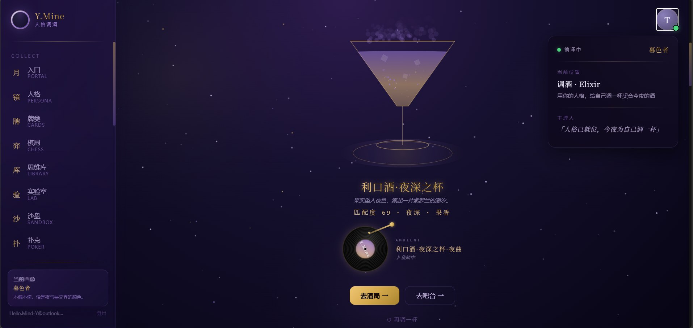

# Y.Mine · 人格调酒系统

> 人格 × 感官 × 时间 · 把一个人的决策风格、感官偏好、昼夜节律，织成同一份向量

## 🍸 [Live Demo → hellomind-star.github.io/personality-wine-mixing](https://hellomind-star.github.io/personality-wine-mixing/)



Y.Mine 以六维人格向量为统一契约，把人格画像、感官偏好、时间生物学映射到同一份数据结构，再派生出调酒推荐、气味配方、酒局匹配等多模态产物。这不是问卷换酒单，是向量织夜。

---

## 这是什么

一个**纯前端人格派生系统**：

- **六维人格向量**（TOL 容错 / SPD 速度 / INF 信息 / ENT 热情 / LEAD 主导 / VIS 直觉）作为统一数据契约
- **时间生物学校准**：皮质醇 / 褪黑素 / 睾酮 / 血清素的昼夜曲线动态偏移向量
- **感官货币**：一份向量派生视觉（色）/ 听觉（乐）/ 嗅觉（香）/ 味觉（酒）
- **双轨人格采集**：静轨问卷 + 动轨棋局（MBTI 四维度映射棋局行为）
- **酒局融合**：多人 MBTI 融合计算，输出"张力之杯 / 共鸣之杯"
- **反馈回路**：评分 → 向量校准 → 推荐优化闭环（纯函数 calibrateVector）

---

## 生态定位

本站是 **Y.Mine 五域生态**中的 **MBTI 人格调酒线**，与 ymine 主站 / finance / poker-egg / validation-hub 等站点组成**六站回跳矩阵**——每站右下角的「🌌 Y.Mine 应用矩阵 · 返回作品集」回跳条已全部打通（回跳条全绿），作品集内任意站点可一键互跳。

### 内容资产

- **30 款经典鸡尾酒库**：仅收录公开 IBA 配方，每款携带风味画像与 MBTI 匹配说明
- **SJ 组方案已落地**：ISTJ / ISFJ / ESTJ / ESFJ 四型人格定制酒款上线
- **音乐链路双轨策略**：30 秒试听走本地离线播放，完整版上传网易云、扫码听歌

---

## 功能矩阵

按"采集 → 消费 → 场景"的用户旅程组织：

| 层 | 页面 | 路由 | 状态 | 说明 |
|---|---|---|---|---|
| 入口 | HomePage | `/` | ✅ | 镜月入口 · 时段校准面板 · 智能 CTA |
| 入口 | HubPage | `/hub` | ✅ | 星球枢纽（沉浸） |
| 入口 | ExplorePage | `/explore` | ✅ | 五维探索（沉浸） |
| 采集 | PersonalityPage | `/personality` | ✅ | 大五人格测评 → 落库六维向量 |
| 采集 | CardsPage | `/cards` | ✅ | 牌类采集（塔罗/星盘/扑克/德州） |
| 采集 | ChessPage | `/chess` | ✅ | 国际象棋局 → 棋风人格推导 |
| 消费 | CocktailPage | `/cocktail` | ✅ | 调酒推荐 + 旅程回路 + 评分反馈 |
| 消费 | ScentLabPage | `/scent-lab` | ✅ | 气味分子实验室 |
| 场景 | MbtiPartyPage | `/mbti-party` | ✅ | 多人 MBTI 酒局融合 |
| 场景 | TavernPage | `/tavern` | ✅ | 酒馆夜场氛围 |
| 场景 | BarCounterPage | `/bar-counter` | ✅ | 吧台调酒过程 |
| 底座 | MindLibraryPage | `/mind` | 🟡 骨架 | 已实现的认知引擎展示（向内） |
| 底座 | InvestPage | `/invest` | 🟡 重塑中 | 灵感实验室 · 创意池（向外） |

---

## 技术栈

- **框架**：React 18 + Vite 5 + TypeScript 5
- **路由**：React Router v6（路由级 `React.lazy` 懒加载）
- **样式**：Tailwind CSS 3（深空紫金视觉语言）
- **可视化**：ECharts 按需引入 / Canvas 2D 粒子动画
- **音频**：Web Audio API（白噪声 + pad 合成）
- **测试**：Vitest 4（637 用例，5 个 journey 集成测试待修，详见 [docs/ROADMAP.md](./docs/ROADMAP.md)）

---

## 快速开始

```bash
npm install        # 安装依赖
npm run dev        # 启动开发服务器 → http://localhost:5173
npm run build      # 类型检查 + 生产构建
npm test           # 运行单元测试
npm run lint       # TypeScript 类型检查
```

**构建产物**：主包 101KB（gzip 40.72KB），vendor 拆分（react 163KB / echarts 413KB），首屏无警告。

---

## 架构分层

```
UI → hooks/store → service → engine → data
```

严格的依赖方向，**引擎永不被前端直接 import**。

| 层 | 允许依赖 | 禁止依赖 |
|---|---|---|
| UI（pages / components） | hooks、store、types | engine、service、data |
| hooks / store | service、types | engine、data |
| service | engine、data、types | React、UI |
| engine | data、types | React、UI、service、IO |
| data | types | 任何业务层 |

详见 [docs/architecture.md](./docs/architecture.md)。

---

## 项目结构

```
src/
├── components/        # UI 组件（cocktail / layout / personality / mbtiparty / scentlab / ui）
├── data/              # 静态数据表（向量映射 / 风味 / 棋风 / 塔罗 / 气味）
├── engine/            # 15 个纯函数引擎
│   ├── timeEngine          # 时间生物学校准
│   ├── cocktailEngine      # 余弦相似度推荐
│   ├── personaFusionEngine # 多人 MBTI 融合
│   ├── feedbackEngine      # 反馈回路校准
│   ├── profileToVector     # OCEAN → 六维向量
│   ├── oceanToVector       # 同上（双入口）
│   ├── scentEngine         # 气味派生
│   ├── colorFromVector     # 视觉色派生
│   ├── flavorFromVector    # 风味派生
│   ├── moodEngine          # 情绪融合
│   ├── journeyEngine       # 旅程回路
│   ├── lightEngine         # 灯光
│   ├── musicEngine         # 音频合成
│   ├── hostEngine          # 主理人状态
│   └── personalityEngine   # 大五人格计分
├── pages/             # 13 个路由页面
├── services/          # cocktailService + recommendCache（LRU）
├── store/              # appStore（Context + 持久化分层）
├── types/              # 9 个类型定义
└── hardware/           # coasterProtocol（杯垫协议）
```

---

## 约束规范

项目遵循严格的视觉与数据流约束，核心规则包括：

- **动画**：必须使用 CSS 变量（如 `--scent-color`），禁硬编码颜色；固定粒子数；切换用 `key={...}` 强制重挂载
- **视觉**：深空紫金体系，金线固定 `#f0c674`；卡牌底色为基调融合色（28% 亮度）；评分组件走 `--gold-400`
- **数据流**：用户点星球 → `setManualTimeSlot` → `resolveTimeSlot` → `applyBiologyShift` → `dynamicVector` 喂推荐引擎
- **反馈回路**：`calibrateVector` 必须纯函数（浅拷贝 `{...base}`）；单次校准幅度硬上限 `0.05`，clamp `[0,1]`；评分 ≥4 朝推荐方向 `+0.02`，评分 ≤2 反向 `-0.02`，=3 不动
- **持久化**：`feedbackHistory` 通过 localStorage（key `ymine-feedback`），上限 100 条；`dismissGuide` 用 sessionStorage
- **兜底**：`getCalibratedVector` selector 兜底取最近 `recommendedVec`；`profileToVector(profile)` 在无向量时降级

完整约束清单见 `project_memory.md`。

---

## 当前状态

### ✅ 已完成

- **Phase 0.1**：ChessPage 棋局（落子交互 + 棋风人格推导）
- **Phase 1.1**：chunk 拆分（主包 1618KB → 101KB）
- **Phase 1.2**：ErrorBoundary + Suspense 深空加载态

### 🚧 进行中

- **Phase 1.3**：监控埋点上线（`trackFeedback` 节点已就位，需选上报后端）

### ⚠️ 已知问题

- **journey 集成测试 5 个失败**（`src/test/journey-integration.test.tsx`）：场景 2/3/4/5/7，根因疑似 MoodDial 点击情绪按钮后 intensity 状态异常
- README 与 ROADMAP 同步滞后，待 P1 完成后统一刷新

详见 [docs/ROADMAP.md](./docs/ROADMAP.md)。

---

## 边界澄清

| 页面 | 定位 |
|---|---|
| **MindLibraryPage**（`/mind`） | **向内**：展示已实现的认知引擎架构（染色体 / 斐波那契 / 脉冲函数 / 画圈 / 记忆 / 睡眠） |
| **InvestPage**（`/invest`） | **向外**：重塑为「灵感实验室」· 创意池，承接未实现的点子（待 Phase 后续重塑） |

一个看"已造"，一个看"待造"。

---

## 相关文档

- [架构设计](./docs/architecture.md) — 分层契约、Service API、调用链路
- [路线图](./docs/ROADMAP.md) — Phase 0-4 全景规划与里程碑
- [变更日志](./docs/changelog.md) — 关键改动追溯
- [P0 对话归档](./docs/archive/P0对话.md) — 项目初期开发对话存档

---

## License

Private · 核心引擎仅供学习与内部使用。合作授权另议。

> 核心引擎（人格调酒核心 JS/Python 逻辑）**闭源本地留存**，不随本仓库公开。本 README 仅描述产品层能力，不含核心算法细节。
